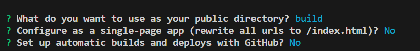

# Netflix GPT

- Create React App
- Configured TailwindCSS 
- Setup Router
- Login Form
- SignUp Form 
- Form Validation
- useRef Hook
- Firebase setup
- Deploy Basic App To Production
- Create Sign Up User Account
- Implement Sign In User Api
- Created Redux Store with UserSlice
- Implement Sign Out
- Authorization
- BugFix : if the user is not logged in redirect /browse to / and vice-versa
- Unsubscribe to onAuthStateChanged Callback
- Add HardCoded Values to the constants file

# Features

- Login/SignUp
    - SignIn/SignUp
    - redirect to Browse Page
- Browse (after authentication)
    - Header
    - Main Movie
        - Trailer in BackGround
        - Title & Description
        - Movie Suggestions
            - MovieLists * N
- NetflixGPT
    - Search Bar
    - Movie Suggestions

## Deploy on firebase

- firebase login 
- firebase init (build folder)
- 
- npm run build
- firebase deploy

## Deploy Link

- https://netflixgpt-5253a.web.app/